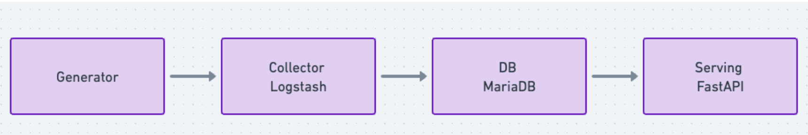
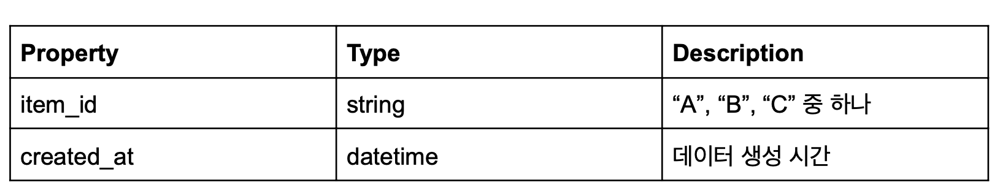
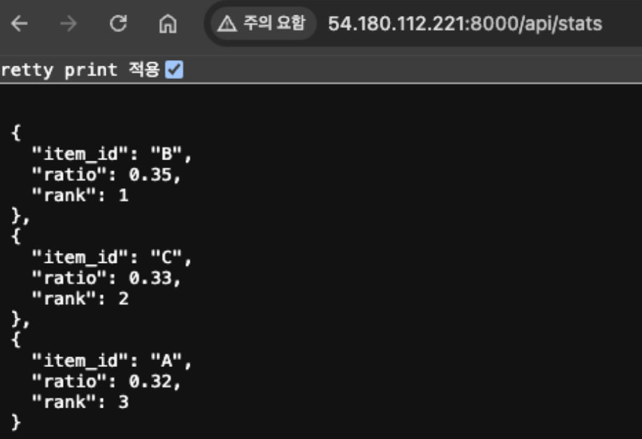

# logstash_pipeline
logstash를 통해 데이터 수집 후 API 제공
- fastAPI / RestAPI
- Logstash
- Mysql

## 프로세스


- Generator는 1초마다 아래 스키마의 데이터 생성
- 
- Collector를 통해 생성된 데이터 수집
- database에 데이터 저장
- API를 통해 데이터 조회
  - GET /api/stats : 아이템들 건수를 기준으로 비율과 랭크를 반환
  - GET /api/count : 특정 기간의 아이템 건수를 반환
<br>

## 환경
### AWS EC2를 통한 서버 구성
- 유연한 확장성: 필요에 따라 인스턴스 크기를 조정 및 확장할 수 있습니다. 
- 빠른 배포: 몇 분만에 새로운 인스턴스를 생성하여 서버를 시작할 수 있습니다.
- 비용 효율성: 사용한 만큼만 비용을 지불합니다.
### Ansible로 배포
- Ansible은 IT 인프라 자동화를 위한 도구로,손쉽게 다수의 서버에 배포가 가능합니다.
- 간편한 배포를 위해 실행 명령어, 환경 변수 등을 설정하여 관리합니다.
<br>

## 구현 방법
1) AWS환경설정
AWS 계정 설정을 위해 .env 파일 수정합니다.
2) 스크립트를 통해 스팟 인스턴스를 생성  실행하여 환경의 EC2 server를 손쉽게 추가합니다.
```commandline
sh setting_aws/setup_server.sh ${EC2_NAME}
```
3) SSH 접속
```commandline
ssh -i /Users/AccessKeyPath/keyname.pem ec2-user@54.180.112.221
```
4) 프로비저닝 Ansible을 통해 애플리케이션 설치
```commandline
# 순서대로 실행
ansible-playbook -i data_pipeline/inventory/hosts.yml data_pipeline/roles/database/tasks/main.yml
ansible-playbook -i data_pipeline/inventory/hosts.yml data_pipeline/roles/serving/tasks/main.yml
ansible-playbook -i data_pipeline/inventory/hosts.yml data_pipeline/roles/collector/tasks/main.yml
ansible-playbook -i data_pipeline/inventory/hosts.yml data_pipeline/roles/generator/tasks/main.yml
```
5) Systemd를 통해 서비스 확인
```commandline
systemctl status gernerator 
systemctl status collector 
systemctl status mariadb 
systemctl status fastapi
```
6) DB 접속하여 데이터 확인
```commandline
mysql -u root -p {$password}
> use data
> select * from collector order by created_at desc limit 10;
```
7) Fast Web Server API 확인
```commandline
http://54.180.112.221:8000/docs
```
8) API 호출
```commandline
http://54.180.112.221:8000/api/stats
http://54.180.112.221:8000/api/count?item_id=A&from=2024-12-02T10:50:01.000&to=2024-12-20T20:20:59.000
```

